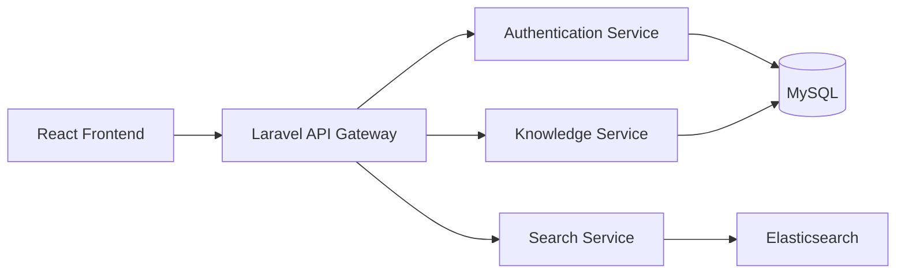

# 🧠 BraineBase

### *Second Brain, Zero Clutter*

[](https://github.com/OuafikMohammed/BraineBase---Knowledge-Management-System/stargazers)
[](https://github.com/OuafikMohammed/BraineBase---Knowledge-Management-System/network/members)
[](https://github.com/OuafikMohammed/BraineBase---Knowledge-Management-System/issues)
[](https://github.com/OuafikMohammed/BraineBase---Knowledge-Management-System/blob/main/LICENSE)


---

## 🌟 Overview

**BraineBase** isn't just another note-taking app — it's a full-fledged **knowledge management ecosystem** designed for thinkers, teams, and organizations who want to preserve, organize, and leverage their collective intelligence. Whether you're a solo developer documenting your learning journey or a company building an internal wiki, BraineBase scales with you.

> *"The only knowledge that matters is the knowledge you can retrieve when you need it."*

---

## ✨ Features That Matter

| Feature | Description |
|---------|-------------|
| 🔐 **Fort Knox Authentication** | Secure JWT-based auth system with role management |
| 📝 **Rich Article Editor** | Create beautiful knowledge articles with full formatting |
| 🔍 **Lightning Search** | Find anything instantly with elastic search capabilities |
| 🗂️ **Smart Categorization** | Organize knowledge your way with nested categories & tags |
| 👥 **Team Collaboration** | Share, comment, and co-edit with your team in real-time |
| 📊 **Version Control** | Never lose a thought — full revision history for every article |
| 📱 **Responsive Design** | Access your knowledge anywhere, on any device |
| 🔌 **API-First Architecture** | Build on top of BraineBase with our powerful REST API |

---

## 🏗️ Architecture



---

## 🚀 Quick Start

### Prerequisites
- Node.js ≥ 16.x
- PHP ≥ 8.1
- MySQL ≥ 5.7
- Composer

### Installation

```bash
# Clone the frontend
git clone https://github.com/OuafikMohammed/BraineBase---Knowledge-Management-System.git
cd BraineBase---Knowledge-Management-System

# Install frontend dependencies
npm install

# Set up environment
cp .env.example .env
# Edit .env with your configuration

# Start the development server
npm start
```

### Backend Setup
The Laravel backend lives in a [separate repository](https://github.com/OuafikMohammed/BrainBase-Backend):

```bash
git clone https://github.com/OuafikMohammed/BrainBase-Backend.git
cd BrainBase-Backend
composer install
php artisan migrate
php artisan serve
```

---


---

## 🧪 Tech Stack Deep Dive

**Frontend** (`/`)
- ⚛️ React 18 with Hooks
- 🎨 Bootstrap 5 + Custom CSS Modules
- 📦 Axios for API communication
- 🔄 React Router v6
- 🗃️ Context API for state management

**Backend** ([separate repo](https://github.com/OuafikMohammed/BrainBase-Backend))
- 🏗️ Laravel 10 with Eloquent ORM
- 🔑 JWT Authentication (tymondesigns/jwt-auth)
- 📄 RESTful API design
- 🗄️ MySQL database
- 🔍 Laravel Scout for search

---

## 📁 Project Structure

```
BraineBase/
├── public/               # Static assets
├── src/
│   ├── components/       # Reusable UI components
│   ├── pages/            # Main application pages
│   ├── services/         # API service layer
│   ├── context/          # Global state management
│   ├── hooks/            # Custom React hooks
│   ├── utils/            # Helper functions
│   └── styles/           # CSS modules
├── tests/                # Frontend tests
└── package.json          # Dependencies
```

---

## 🤝 Contributing

We welcome contributions! Here's how you can help:

1. 🍴 Fork the repository
2. 🌿 Create your feature branch (`git checkout -b feature/AmazingFeature`)
3. 💻 Commit your changes (`git commit -m 'Add some AmazingFeature'`)
4. 🚀 Push to the branch (`git push origin feature/AmazingFeature`)
5. 🔍 Open a Pull Request

Check out our [Contributing Guidelines](CONTRIBUTING.md) for more details.


[](https://github.com/OuafikMohammed)


---

### ⭐ Found this project useful? Give it a star! It helps others discover it.

<p align="center">Made with ❤️ by developers, for knowledge seekers</p>
